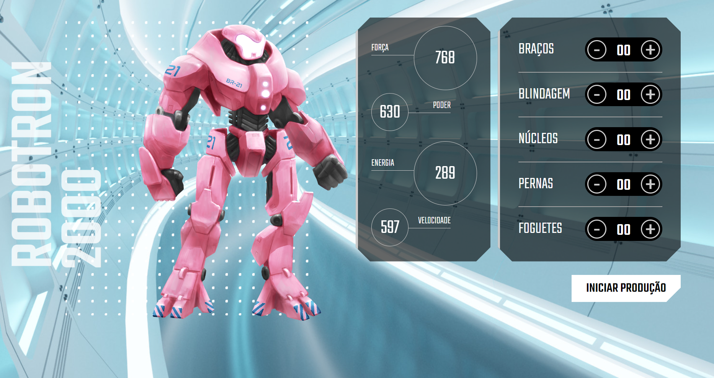

# Robotron

Projeto desenvolvido durante o curso de "JavaScript: manipulando o DOM"

 

> Linguagens utilizadas:
>
> - HTML
> - CSS
> - Java Script

[Link para a página](https://veronicaparanhos.github.io/robotron/)
